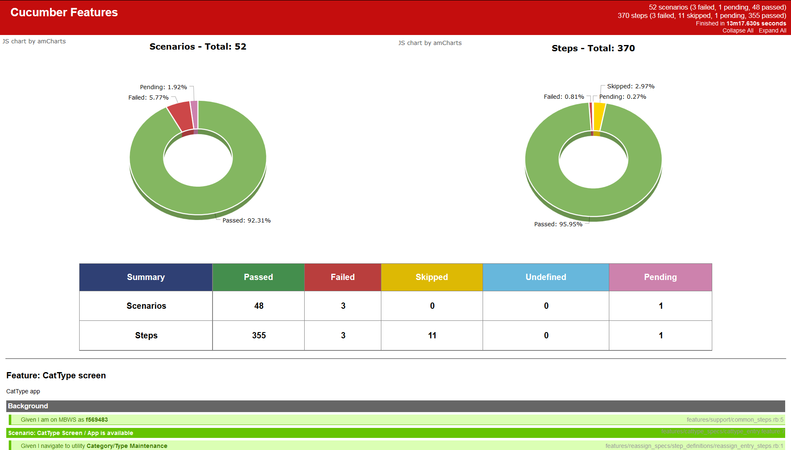

# CUCUMBER-RUBY/JRUBY

## How to run (Windows) --
_(Make sure you have ruby/jruby installed)_

* clone this repo

* cd into root of the project

* execute in cli (in case bundler is not installed) (don't need "jruby -S" if using ruby)

	```
	jruby -S gem install bundler
	```

* execute in cli

	```
	jruby -S bundle
	```

* execute in cli (run with bundle exec)

	```
	jruby -S bundle exec cucumber
	```

## Custom HTML summary and detail report (yes still a WIP, but feel free to change it)
* execute in cli

	```
	jruby -S bundle exec cucumber --format Cucumber::Formatter::Html_pretty --out <my_html_file>.html
	```

### Example screen shot
  
### Useful commands
* run one feature

	```
	jruby -S bundle exec cucumber features/<my_feature>.feature
	```

* run one scenario in a feature (its the line number where the scenario starts)

	```
	jruby -S bundle exec cucumber features/<my_feature>.feature:27
	```

* compressed results (as printed on cli)

	```
	jruby -S bundle exec cucumber --format pretty --quiet
	```

* print results in an html file for easy viewing

	```
	jruby -S bundle exec cucumber --format html --out <my_html_file>.html
	```

	#### Reference Material
	* Gherkin (doc) - https://cucumber.io/docs/reference
	* Capybara cheat sheet - https://gist.github.com/elfassy/11399304
	* Capybara (doc) - http://www.rubydoc.info/github/jnicklas/capybara
	* Rspec Expectation matchers - https://github.com/rspec/rspec-expectations#user-content-built-in-matchers
	* More on Rspec - https://www.relishapp.com/rspec/rspec-expectations/docs/built-in-matchers

	_For colors in CLI follow this for ANSICON setup_ - http://stackoverflow.com/questions/4746647/cucumber-not-showing-coloured-output-in-windows
